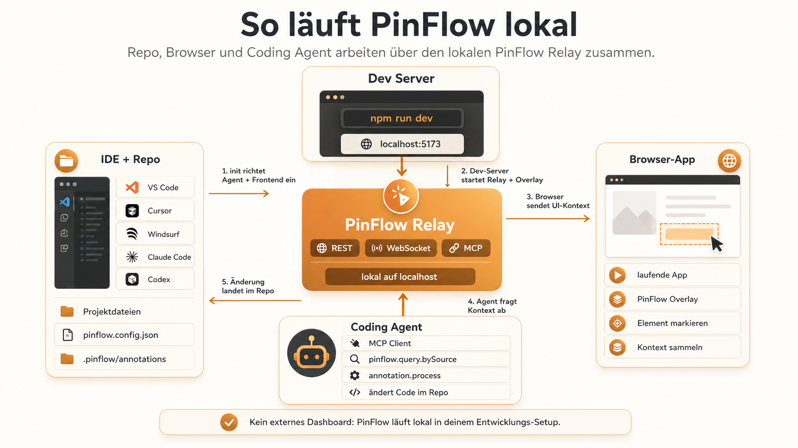
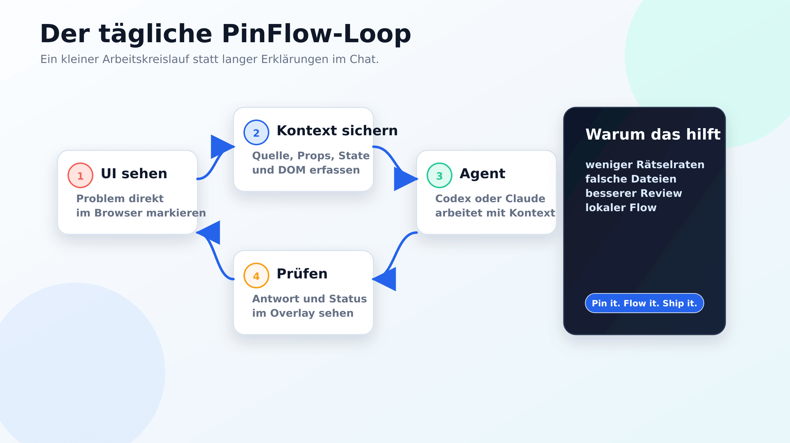
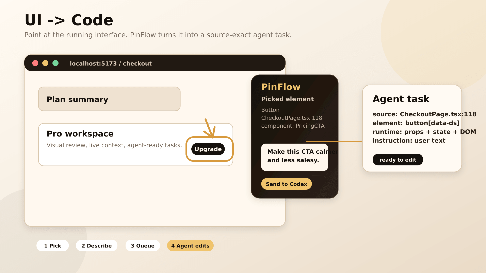
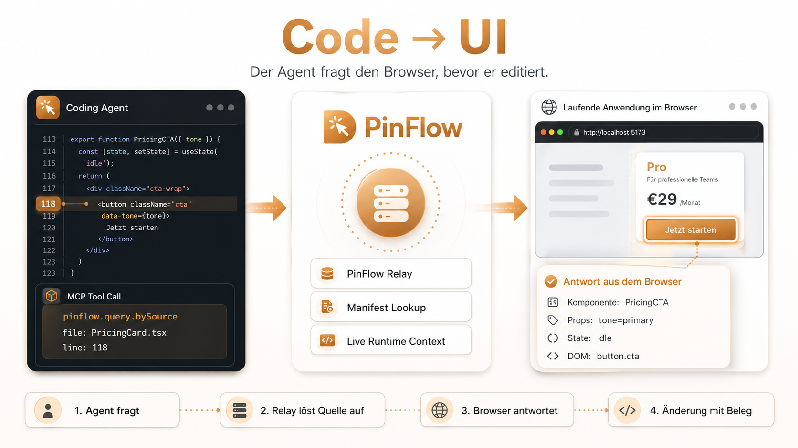
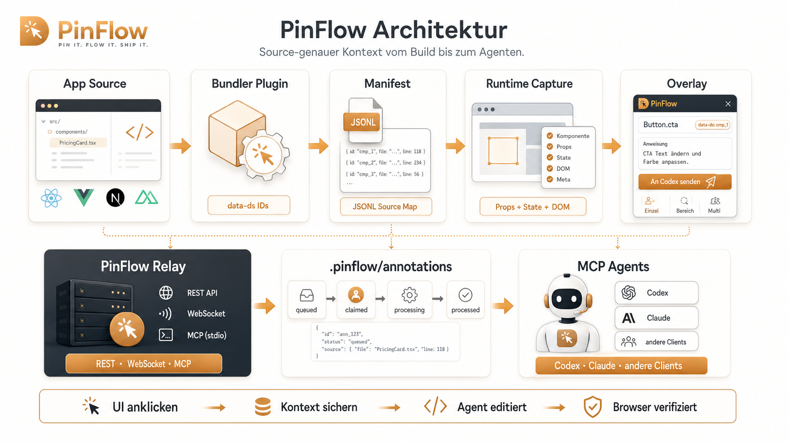
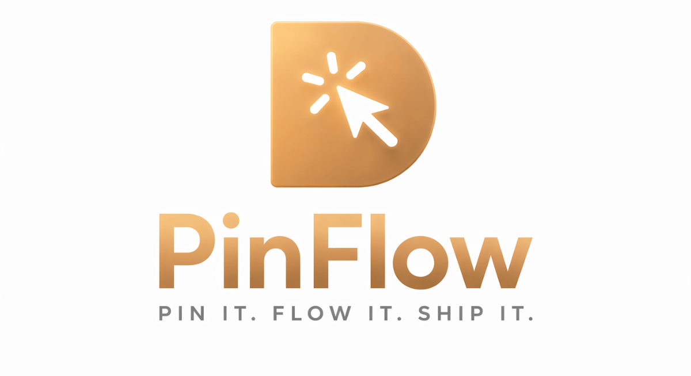

<p align="center">
  
</p>

<p align="center">
  <a href="https://www.npmjs.com/package/pinflow"></a>
  <a href="https://github.com/Dom-303/pinflow/actions/workflows/ci.yml"></a>
  <a href="#lokale-prüfung"></a>
  <a href="./LICENSE"></a>
  <a href="./package.json"></a>
  <a href="./package.json">= 20" /></a>
  <a href="https://github.com/Dom-303/pinflow/pulls"></a>
  <a href="https://modelcontextprotocol.io/"></a>
</p>

<p align="center">
  <a href="./packages/pinflow-react"></a>
  <a href="./packages/pinflow-vue"></a>
  <a href="./packages/pinflow-next"></a>
  <a href="./packages/pinflow-nuxt"></a>
  <a href="./packages/pinflow-transform"></a>
  <a href="./packages/pinflow-transform"></a>
  <a href="./packages/pinflow-transform"></a>
</p>

<p align="center">
  <a href="https://help.openai.com/en/articles/11369540-codex-in-chatgpt"></a>
  <a href="https://docs.anthropic.com/en/docs/claude-code/overview"></a>
  <a href="https://docs.github.com/en/copilot/concepts/agents/about-copilot-cli"></a>
  <a href="https://docs.cursor.com/en/context/mcp"></a>
  <a href="https://google-gemini.github.io/gemini-cli/docs/"></a>
  <a href="https://aws.amazon.com/documentation-overview/kiro/"></a>
</p>

---

**PinFlow verbindet dein laufendes Frontend mit deinem Coding Agenten.**

Du klickst im Browser auf ein Element, beschreibst die gewünschte Änderung und
PinFlow legt daraus eine präzise Aufgabe an: mit Source-Datei, Zeile,
Komponente, Props, State, DOM-Kontext und deiner Anweisung. Codex, Claude oder
jeder MCP-kompatible Agent kann den Kontext anschließend direkt verwenden,
statt im Code zu raten.

PinFlow ist bewusst ein Developer-Tool für die lokale Arbeit: sichtbar im
Browser, nachvollziehbar im Repository, anschlussfähig für Agenten.
[Doom-Script / Domscribe](https://github.com/patchorbit/domscribe) bildet dafür
die starke technische Grundlage, auf der PinFlow als fokussierter,
produktisierter Agent-Workflow weiterbaut.

## Schnellstart

Voraussetzung: Node.js 20 oder neuer.

```bash
npx pinflow init
```

Der Wizard führt durch zwei Schritte:

1. **Agent verbinden** - Codex, Claude oder einen anderen MCP-Client auswählen.
2. **Frontend anbinden** - Framework und Bundler wählen, Package installieren,
   Config-Snippet übernehmen.

Danach startest du deinen Dev-Server und öffnest die App im Browser. Das
PinFlow-Overlay ist dann bereit für Markierungen, Aufgaben und Live-Kontext.

Alternativen:

- Installiert: `pinflow init`
- Ohne Installation: `npx pinflow init`

## Wie PinFlow lokal läuft

PinFlow ist kein separates Cloud-Dashboard und keine VS-Code-only Extension.
Es läuft in deinem normalen lokalen Entwicklungs-Setup: dein Repo liegt in der
IDE, dein Frontend läuft auf `localhost`, PinFlow hängt sich über Framework- und
Bundler-Integration in die App ein und dein Coding Agent verbindet sich über
MCP mit dem lokalen Relay.

<p align="center">
  
</p>

Der wichtige Punkt: Der Browser liefert den sichtbaren UI-Kontext, das Repo
liefert Source-Dateien und lokale Aufgaben, und der Agent fragt beides über
PinFlow ab. Dadurch bleibt der Workflow nah an deiner echten App, ohne dass du
Screenshots, DOM-Details oder Datei-Vermutungen manuell in den Chat tragen
musst.

## Was PinFlow löst

- **UI-Wünsche werden konkrete Code-Aufgaben.** Nicht "irgendwo ist ein Button
  falsch", sondern `PricingCard.tsx:118` plus Laufzeitkontext.
- **Agenten sehen den Browser-Kontext.** Mit `pinflow.query.bySource` kann ein
  Agent prüfen, was eine Source-Zeile gerade live rendert.
- **Der Arbeitsstand bleibt lokal.** Annotationen liegen in
  `.pinflow/annotations/`, Statuswechsel laufen über Relay, REST, WebSocket und
  MCP.
- **Production bleibt sauber.** Die Instrumentierung ist development-only und
  wird aus Production Builds entfernt.

## Der tägliche Loop

<p align="center">
  
</p>

Der Kern ist kein riesiger Prozess, sondern ein kurzer Kreislauf: im Browser
sehen, Kontext sichern, Agenten arbeiten lassen, Ergebnis wieder im Browser
prüfen.

## Zwei Arbeitsrichtungen

### UI -> Code

Du markierst im laufenden UI ein Element oder einen Bereich. PinFlow sammelt
Source-Position, Komponente, DOM, Props, State und deine Anweisung. Daraus wird
eine Aufgabe, die ein Agent claimen, bearbeiten und beantworten kann.

<p align="center">
  
</p>

### Code -> UI

Der Agent kann auch andersherum arbeiten: Er fragt zu einer Datei und Zeile den
Live-Zustand im Browser ab, bevor er editiert.

<p align="center">
  
</p>

> [!TIP]
> Agenten nutzen Runtime-Kontext nicht automatisch. Formuliere es ausdrücklich:
> _"Ändere den CTA. Nutze vorher `pinflow.query.bySource`, um den Live-Kontext
> im Browser zu prüfen."_ Die Zielseite sollte im Browser geöffnet bleiben.

## Features

- **Stabile Build-Time IDs** - deterministische `data-ds` Attribute per AST,
  stabil über HMR und Fast Refresh hinweg
- **Runtime Capture** - Props, State, Komponenten-Metadaten und DOM-Snapshots
  über React Fiber Walking und Vue VNode Inspection
- **Framework Support** - React 18-19, Vue 3, Next.js 15-16, Nuxt 3+ und ein
  [Adapter-Interface](./packages/pinflow-runtime/CUSTOM_ADAPTERS.md)
- **Bundler Support** - Vite 5-7, Webpack 5 und Turbopack
- **Agent Workflow** - Queue, Claim, Process, Respond, Retry, Undo und
  Failure-Status für Overlay und MCP
- **PII Redaction** - E-Mails, Tokens und sensible Muster werden vor dem
  Verlassen des Browsers bereinigt
- **Live Feedback** - WebSocket-Events streamen Antworten und Statuswechsel ins
  Overlay

## Workflow und Einstellungen

| Bereich      | Bedeutung                                                      |
| ------------ | -------------------------------------------------------------- |
| Picker-Modus | Einzelnes Element, Region oder Multi-Select markieren          |
| Dispatch     | Direkt an Codex/Claude senden oder erst nur sammeln            |
| Queue        | Aufgaben von `queued` über `claimed` bis `processed` verfolgen |
| Undo         | Lokale Auswahl zurücknehmen oder Follow-up-Aufgabe erzeugen    |
| Session      | Agent, Dispatch-Verhalten und Defaults sichtbar einstellen     |

Wenn Relay oder MCP nicht laufen, soll PinFlow das klar zeigen: Kontext kann
weiter gesammelt werden, Agent Processing braucht aber die lokale Verbindung.

## Architektur

<p align="center">
  
</p>

1. **Inject** - der Bundler injiziert stabile `data-ds` IDs und schreibt das
   Manifest nach `.pinflow/manifest.jsonl`.
2. **Capture** - Runtime Adapter sammeln DOM, Props, State und Komponenteninfos
   aus der laufenden App.
3. **Relay** - ein lokaler Fastify-Daemon verbindet Browser, Repository und MCP.
4. **Agent** - Codex, Claude oder andere MCP-Clients fragen Live-Kontext ab oder
   bearbeiten Annotationen.

## Installation im Detail

> [!NOTE]
> `npx pinflow init` erledigt die Setup-Schritte automatisch. Die manuelle
> Einrichtung ist vor allem für Monorepos oder bewusst kontrollierte Setups
> gedacht.

### App-Seite

<details>
<summary><strong>Next.js 15/16</strong> - <code>npm install -D @pinflow/next</code></summary>

```ts
// next.config.ts
import type { NextConfig } from 'next';
import { withPinFlow } from '@pinflow/next';

const nextConfig: NextConfig = {};

export default withPinFlow()(nextConfig);
```

</details>

<details>
<summary><strong>Nuxt 3+</strong> - <code>npm install -D @pinflow/nuxt</code></summary>

```ts
// nuxt.config.ts
export default defineNuxtConfig({
  modules: ['@pinflow/nuxt'],
});
```

</details>

<details>
<summary><strong>React 18/19 mit Vite</strong> - <code>npm install -D @pinflow/react</code></summary>

```ts
// vite.config.ts
import { defineConfig } from 'vite';
import react from '@vitejs/plugin-react';
import { pinflow } from '@pinflow/react/vite';

export default defineConfig({
  plugins: [react(), pinflow()],
});
```

</details>

<details>
<summary><strong>React 18/19 mit Webpack</strong> - <code>npm install -D @pinflow/react</code></summary>

```js
// webpack.config.js
const { PinFlowWebpackPlugin } = require('@pinflow/react/webpack');

module.exports = {
  plugins: [new PinFlowWebpackPlugin()],
};
```

</details>

<details>
<summary><strong>Vue 3 mit Vite</strong> - <code>npm install -D @pinflow/vue</code></summary>

```ts
// vite.config.ts
import { defineConfig } from 'vite';
import vue from '@vitejs/plugin-vue';
import { pinflow } from '@pinflow/vue/vite';

export default defineConfig({
  plugins: [vue(), pinflow()],
});
```

</details>

<details>
<summary><strong>Vue 3 mit Webpack</strong> - <code>npm install -D @pinflow/vue</code></summary>

```js
// webpack.config.js
const { PinFlowWebpackPlugin } = require('@pinflow/vue/webpack');

module.exports = {
  plugins: [new PinFlowWebpackPlugin()],
};
```

</details>

<details>
<summary><strong>Framework-unabhängig</strong> - <code>npm install -D @pinflow/transform</code></summary>

```ts
// vite.config.ts
import { defineConfig } from 'vite';
import { pinflow } from '@pinflow/transform/plugins/vite';

export default defineConfig({
  plugins: [pinflow()],
});
```

Diese Variante liefert DOM-zu-Source-Mapping, aber keine tiefen Framework-Props
oder State-Daten.

</details>

<details>
<summary><strong>Framework-unabhängig mit Webpack</strong> - <code>npm install -D @pinflow/transform</code></summary>

```js
// webpack.config.js
const { PinFlowWebpackPlugin } = require('@pinflow/transform/plugins/webpack');

module.exports = {
  plugins: [new PinFlowWebpackPlugin()],
};
```

</details>

### Monorepos

```bash
npx pinflow init --app-root apps/web
```

Das erzeugt `pinflow.config.json` am Repo-Root. CLI, Relay und MCP lösen den
App-Pfad anschließend automatisch auf.

### Agent-Seite

#### Claude Code

```shell
claude plugin marketplace add Dom-303/pinflow
claude plugin install pinflow@pinflow
```

#### Codex

Codex Support liegt im Repo über `.codex-plugin/plugin.json` und
[AGENTS.md](./AGENTS.md).

#### Jeder MCP-Client

```json
{
  "mcpServers": {
    "pinflow": {
      "type": "stdio",
      "command": "npx",
      "args": ["-y", "@pinflow/mcp"]
    }
  }
}
```

## Herkunft und Einordnung

PinFlow ist aus der Idee entstanden, Frontend-Arbeit für Agenten sichtbarer und
präziser zu machen. Domscribe, das ursprüngliche DOM-Skript, war dabei die
technische Grundlage: stark als Konzept und Experiment, aber noch nicht als
rundes, friend-ready Repository. PinFlow führt diese Richtung weiter und
verbindet sie mit einer source-genauen Runtime-Grundlage.

| Bereich       | Domscribe / Grundlage              | Source-Mapping-Grundlage         | PinFlow heute                       |
| ------------- | ---------------------------------- | -------------------------------- | ----------------------------------- |
| Ziel          | Agenten näher an UI-Arbeit bringen | DOM-Elemente auf Source abbilden | Voller UI-zu-Agent Workflow         |
| Oberfläche    | Konzeptuell, noch roh              | Technische Primitive             | Overlay, Picker, Queue, Settings    |
| Agenten       | Gedacht als Workflow               | MCP-nahe Bausteine               | Codex/Claude-ready MCP Flow         |
| Repo-Eindruck | Noch nicht fertig zum Teilen       | Technisch erklärbar              | Deutsche README, Visuals, Setup     |
| Fokus         | Idee und Richtung                  | Präzision der Zuordnung          | Produktisierte Entwickler-Erfahrung |

## Vergleich

Legende: ✅ klar vorhanden · ◐ teilweise/anderer Fokus · ✕ nicht erkennbar

<table>
  <thead>
    <tr>
      <th>Feature</th>
      <th>PinFlow</th>
      <th><a href="https://github.com/patchorbit/domscribe">Domscribe</a></th>
      <th><a href="https://github.com/stagewise-io/stagewise">stagewise</a></th>
      <th><a href="https://sveltethemes.dev/mcpc-tech/dev-inspector-mcp">DevInsp.</a></th>
      <th><a href="https://github.com/aidenybai/react-grab">React Grab</a></th>
      <th><a href="https://frontman.sh/vs/cursor">Frontman</a></th>
    </tr>
  </thead>
  <tbody>
    <tr><td>Stable IDs</td><td>✅ AST <code>data-ds</code></td><td>✅ AST <code>data-ds</code></td><td>✕ Runtime/CDP</td><td>◐ AST, unstabil</td><td>✕ <code>_debugSource</code></td><td>✕ Runtime APIs</td></tr>
    <tr><td>DOM→Source</td><td>✅ JSONL</td><td>✅ JSONL</td><td>✕</td><td>✕</td><td>✕</td><td>✕</td></tr>
    <tr><td>Code→Live UI</td><td>✅ Source→Runtime</td><td>✅ Source→Runtime</td><td>✕</td><td>✕</td><td>✕</td><td>✕</td></tr>
    <tr><td>Runtime ctx</td><td>✅ Props · State · DOM</td><td>✅ Props · State · DOM</td><td>◐ flach</td><td>◐ DOM + JS eval</td><td>✕ HTML + Namen</td><td>◐ Props</td></tr>
    <tr><td>Frameworks</td><td>✅ React · Vue · Next · Nuxt</td><td>✅ React · Vue · Next · Nuxt</td><td>◐ React</td><td>✅ React · Vue · Svelte · Solid</td><td>✕ React</td><td>◐ Next · Astro · Vite</td></tr>
    <tr><td>Bundler</td><td>✅ Vite · Webpack · Turbo</td><td>✅ Vite · Webpack · Turbo</td><td>✕ N/A</td><td>✅ Vite · Webpack · Turbo</td><td>✕ N/A</td><td>◐ Middleware</td></tr>
    <tr><td>MCP</td><td>✅ 12 Tools · 4 Prompts</td><td>✅ 12 Tools · 4 Prompts</td><td>✕ Karton</td><td>✅ 9 Tools</td><td>◐ Add-on</td><td>✕ intern</td></tr>
    <tr><td>Agent-neutral</td><td>✅ jeder MCP-Client</td><td>✅ jeder MCP-Client</td><td>✕ bundled</td><td>✅</td><td>✅</td><td>✕ bundled</td></tr>
    <tr><td>Picker</td><td>✅ Shadow DOM</td><td>✅ Shadow DOM</td><td>✅ Browser selector</td><td>✅ Inspector bar</td><td>✅ Hover</td><td>✅ Chat</td></tr>
    <tr><td>Picker-Modi</td><td>✅ Element · Region · Multi</td><td>◐ Element</td><td>◐ Element</td><td>◐ Inspector</td><td>◐ Hover</td><td>◐ Chat</td></tr>
    <tr><td>Dispatch</td><td>✅ Auto · Codex · Claude · Queue</td><td>◐ Queue + MCP</td><td>✕</td><td>◐ MCP/ACP</td><td>✕</td><td>✕</td></tr>
    <tr><td>Regeln</td><td>✅ Manual · Immediate · Threshold</td><td>✕</td><td>✕</td><td>✕</td><td>✕</td><td>✕</td></tr>
    <tr><td>Fortsetzung</td><td>✅ Manual · Confirm · Automatic</td><td>✕</td><td>✕</td><td>✕</td><td>✕</td><td>✕</td></tr>
    <tr><td>Session</td><td>✅ Defaults + Overrides</td><td>✕</td><td>✕</td><td>✕</td><td>✕</td><td>✕</td></tr>
    <tr><td>Queue</td><td>✅ Queue + Batch-Status</td><td>✅ Queue</td><td>✕</td><td>◐ Tooling</td><td>✕</td><td>✕</td></tr>
    <tr><td>Lizenz</td><td>✅ MIT</td><td>✅ MIT</td><td>◐ AGPL</td><td>✅ MIT</td><td>✅ MIT</td><td>◐ Apache + AGPL</td></tr>
  </tbody>
</table>

PinFlows Stärke ist die Kombination: stabile Source-Zuordnung, Live-Kontext,
visuelles Markieren, lokale Queue und MCP-Werkzeuge in einem zusammenhängenden
Workflow.

Quellen und Einordnung:

- [Domscribe](https://github.com/patchorbit/domscribe) ist die ursprüngliche
  Grundlage: Build-time IDs, DOM→Source Manifest, Code→Live DOM Query,
  Runtime-Kontext, MCP Tools sowie React/Vue/Next/Nuxt, Vite/Webpack/Turbopack.
- [stagewise](https://stagewise.io/docs) positioniert sich als Browser-Agent
  für laufende Web-Apps mit DOM-Kontext, kompatiblen Frameworks und eigenem
  Agentenflow; das GitHub-Repo nennt AGPL-3.0.
- [DevInspector MCP](https://sveltethemes.dev/mcpc-tech/dev-inspector-mcp)
  beschreibt MCP/ACP-Flows mit Source Location, DOM, Styles, Network, Console,
  Screenshots und Framework-Support für React, Vue, Svelte, SolidJS, Preact und
  Next.js.
- [React Grab](https://github.com/aidenybai/react-grab) fokussiert React:
  Element auswählen, Kontext kopieren, darunter HTML, React-Komponente,
  File-Source und Hierarchie.
- [Frontman](https://frontman.sh/vs/cursor) läuft browserbasiert über
  Framework-Plugins, nutzt einen browserseitigen MCP-Server für DOM, Screenshots
  und computed CSS und editiert Source-Dateien mit Hot Reload.

### PinFlow vs. Doom-Script / Domscribe

| Bereich                  | PinFlow | Domscribe | Was PinFlow darauf aufbaut                                |
| ------------------------ | :-----: | :-------: | --------------------------------------------------------- |
| Build-time IDs           |   ✅    |    ✅     | unverändert starke Source-Zuordnung                       |
| DOM→Source Manifest      |   ✅    |    ✅     | PinFlow behält JSONL/Manifest-Basis                       |
| Code→Live-UI Query       |   ✅    |    ✅     | Agenten können weiter Source-Stellen live abfragen        |
| Runtime Props/State/DOM  |   ✅    |    ✅     | React/Vue Runtime-Kontext bleibt erhalten                 |
| MCP Tools                |   ✅    |    ✅     | PinFlow nutzt die Tool-Basis weiter                       |
| Annotation Lifecycle     |   ✅    |    ✅     | Queue/Claim/Respond bleibt Kern des Workflows             |
| WebSocket Feedback       |   ✅    |    ✅     | Statuswechsel bleiben live im Overlay sichtbar            |
| Framework-/Bundler-Basis |   ✅    |    ✅     | React, Vue, Next, Nuxt, Vite, Webpack, Turbopack          |
| Picker: Element          |   ✅    |    ✅     | bestehender UI→Code-Pfad                                  |
| Picker: Region           |   ✅    |     ✕     | Bereichsauswahl für breitere UI-Kontexte                  |
| Picker: Multi-Select     |   ✅    |     ✕     | mehrere Elemente als gemeinsame Aufgabe                   |
| Provider-Kanal           |   ✅    |     ✕     | Auto, Codex, Claude oder Queue-only                       |
| Dispatch-Modus           |   ✅    |     ✕     | Manual, Immediate oder Threshold                          |
| Fortsetzung              |   ✅    |     ✕     | Manual, Confirm oder Automatic                            |
| Projektdefaults          |   ✅    |     ✕     | dauerhafte Dispatch-Standards                             |
| Session-Overrides        |   ✅    |     ✕     | temporäre Regeln nur für die laufende Sitzung             |
| Batch-/Run-Status        |   ✅    |     ✕     | sichtbarer Fortschritt für freigegebene Aufgaben          |
| Undo-/Follow-up-Fluss    |   ✅    |     ✕     | Auswahl zurücknehmen oder Anschlussaufgabe erzeugen       |
| README-Produktauftritt   |   ✅    |     ◐     | deutsche README, PinFlow-Visuals, lokales Setup-Bild, CTA |

Kurz gesagt: Domscribe ist die profunde Grundlage. PinFlow übernimmt diese
starke technische Basis und legt darüber eine stärker geführte Produkt-,
Settings- und Dispatch-Erfahrung für Codex-, Claude- und MCP-Workflows.

## MCP Tools

| Tool                              | Zweck                                                       |
| --------------------------------- | ----------------------------------------------------------- |
| `pinflow.query.bySource`          | Source-Datei und Zeile im Live-Browser abfragen             |
| `pinflow.manifest.query`          | Manifest nach Datei, Komponente oder Element-ID durchsuchen |
| `pinflow.manifest.stats`          | Manifest-Statistiken abrufen                                |
| `pinflow.resolve`                 | `data-ds` ID zu Source-Position auflösen                    |
| `pinflow.resolve.batch`           | Mehrere IDs auf einmal auflösen                             |
| `pinflow.annotation.process`      | Nächste Queue-Aufgabe claimen                               |
| `pinflow.annotation.respond`      | Agent-Antwort speichern und Aufgabe abschließen             |
| `pinflow.annotation.updateStatus` | Status manuell ändern                                       |
| `pinflow.annotation.get`          | Annotation per ID laden                                     |
| `pinflow.annotation.list`         | Annotationen filtern und listen                             |
| `pinflow.annotation.search`       | Volltextsuche über Annotationen                             |
| `pinflow.status`                  | Relay-, Manifest- und Queue-Status abrufen                  |

Details stehen im [`@pinflow/mcp` README](./packages/pinflow-mcp/README.md).

## Annotation Lifecycle

| Von          | Nach         | Auslöser                                           |
| ------------ | ------------ | -------------------------------------------------- |
| `queued`     | `processing` | Agent claimt die nächste Aufgabe per MCP           |
| `processing` | `processed`  | Agent speichert Antwort und schließt die Aufgabe   |
| `processing` | `failed`     | Agent-Fehler, Abbruch oder Timeout                 |
| `processed`  | `archived`   | Entwickler räumt erledigte Aufgaben im Overlay auf |

Der praktische Ablauf: Du markierst ein Element im Browser, PinFlow speichert
die Aufgabe lokal in `.pinflow/annotations`, der Agent claimt sie atomar,
ändert die passende Datei und schreibt seine Antwort zurück. Das Overlay erhält
Statuswechsel über WebSocket.

## Packages

| Package              | Inhalt                                           |
| -------------------- | ------------------------------------------------ |
| `@pinflow/core`      | Schemas, Fehlerformat, IDs, PII Redaction        |
| `@pinflow/manifest`  | JSONL Manifest, IDStabilizer, BatchWriter        |
| `@pinflow/relay`     | Fastify HTTP/WS Server, MCP stdio Adapter        |
| `@pinflow/transform` | AST Injection, Vite/Webpack/Turbopack Plugins    |
| `@pinflow/runtime`   | ElementTracker, ContextCapturer, BridgeDispatch  |
| `@pinflow/overlay`   | Lit Web Components, Picker, Annotation UI        |
| `@pinflow/react`     | React Fiber Adapter, Vite/Webpack Plugins        |
| `@pinflow/vue`       | Vue VNode Adapter, Vite/Webpack Plugins          |
| `@pinflow/next`      | `withPinFlow()` für Next.js                      |
| `@pinflow/nuxt`      | Nuxt Modul mit Runtime Plugin                    |
| `pinflow`            | CLI für `init`, `serve`, `status`, `stop`, `mcp` |
| `@pinflow/mcp`       | Standalone MCP Server                            |

## Lokale Prüfung

```bash
pnpm run pinflow:preview:vite-react
```

Für den vollständigen Repo-Check:

```bash
pnpm run release:check
```

Der Release-Check validiert README-Assets, wichtige Package-Metadaten,
Formatierung, Lint, Tests, Build und Typecheck. Der ausführliche Ablauf steht
in [RELEASE.md](./RELEASE.md); lokale Sicherheits- und Datenhinweise stehen in
[SECURITY.md](./SECURITY.md).

## Contributing

```bash
pnpm install
pnpm run build:all
```

Konventionen liegen in `.claude/rules/`. PRs sind willkommen.

---

<p align="center">
  <picture>
    <source
      media="(prefers-color-scheme: dark)"
      srcset="./assets/pinflow-stacked-dark.png"
    />
    
  </picture>
</p>

<h2 align="center">Pin it. Flow it. Ship it.</h2>

<p align="center">
  Starte in deinem Frontend-Repo, öffne die App lokal im Browser und gib deinem
  Coding Agenten den Kontext, den er wirklich braucht.
</p>

<p align="center">
  Besonderer Dank an
  <a href="https://github.com/patchorbit/domscribe">Doom-Script / Domscribe</a>:
  eine außergewöhnlich starke Grundlage, auf der PinFlow weiterbauen konnte.
</p>

<p align="center">
  <code>npx pinflow init</code>
</p>

## License

[MIT](./LICENSE)
