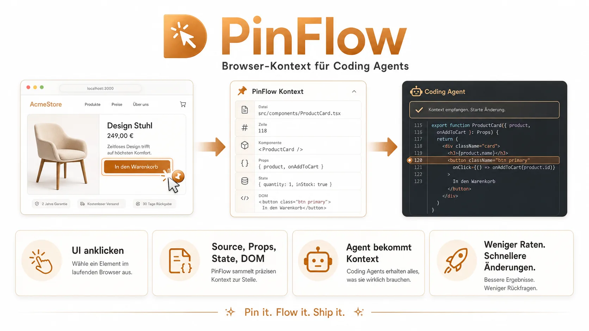

# PinFlow VS Code

Editor-native visibility for the local PinFlow workflow.



## What It Does

PinFlow is the visual input layer, but your repository stays the source of
truth. This extension makes the local PinFlow workflow visible inside VS Code
without replacing the terminal path.

Use it to:

- See whether PinFlow is ready, missing its relay, or not configured.
- Start the normal two-terminal workflow with `PinFlow: Start Workflow`.
- Open the latest run evidence with `PinFlow: Open Latest Run`.
- Inspect `prompt.md`, `transcript.log`, `diff.patch`, changed files, and the
  concise follow timeline from `.pinflow/runs/...`.
- Claim and finish visible external handoffs with `PinFlow: Claim External Task`,
  `PinFlow: Complete External Task`, and `PinFlow: Fail External Task`.

## Requirements

The local `pinflow CLI` must be available in the workspace terminal. The
extension sits on top of the same commands and evidence folders you can use
without VS Code:

```bash
pinflow dev
pinflow follow
```

Run `pinflow dev` to start the relay, runner, and app dev server. Run
`pinflow follow` when you want the terminal timeline beside the editor panel.

## Commands

- `PinFlow: Open Panel` focuses the PinFlow Explorer view.
- `PinFlow: Refresh Panel` reloads workspace status and run evidence.
- `PinFlow: Start Workflow` opens visible terminals for `pinflow dev` and
  `pinflow follow`.
- `PinFlow: Follow Runs` opens a visible `pinflow follow` terminal.
- `PinFlow: Open Latest Run` opens the latest prompt, transcript, and diff.
- `PinFlow: Claim External Task` claims a released annotation with
  `pinflow external claim --json` and opens the generated prompt.
- `PinFlow: Complete External Task` calls `pinflow external complete` only after
  the local repository has a real Git diff.
- `PinFlow: Fail External Task` calls `pinflow external fail` with a readable
  reason.

## Local Package

Build and package a local VSIX from this package directory:

```bash
pnpm run build
pnpm run package:vsix
```

This does not publish the extension. Marketplace publishing still requires
explicit manual approval. The local VSIX is written to
`../../tmp/pinflow-vscode.vsix` from this package directory.
