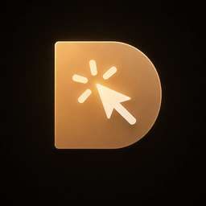

# PinFlow



**Editor-native view of the local PinFlow workflow.** Click an element
in your running web app, capture the runtime context (props, state,
source location), and hand off to a coding agent (Codex, Claude) —
then watch the run live, review its diff, and compare costs
side-by-side without leaving VS Code.

<!-- SCREENSHOT-1 (hero): sidebar with 3-4 runs of mixed status (processing dot pulse, completed check, failed cross), one card expanded showing the cost meta line + changed-files list. Width ~480 px. -->


## What you get

- **Live run transcripts** — expand any run card to stream the agent's
  output as it happens. No polling, no log tailing.
- **Native diff viewer** — click a changed file → VS Code's real diff
  editor opens against `HEAD`. Same keyboard shortcuts you already use.
- **Per-run cost tracking** — every completed run shows
  `codex · gpt-5.5 · 12.4k tok · ~$0.05 · 47s`. The token count is
  parsed from the agent transcript; the USD figure is a directional
  blended-rate estimate.
  <!-- SCREENSHOT-2 (cost line): single expanded run card with the cost meta line clearly visible under the title. Annotate or zoom on it. -->
  
- **Side-by-side run compare** — toggle **Compare** in the sidebar
  header, pick two runs, and a panel renders with provider/model/cost/
  duration/files for each, plus a Δ strip showing cost, token, and
  duration deltas, and which files both agents touched.
  <!-- SCREENSHOT-3 (compare panel): compare mode active (cards have checkboxes, two checked), compare panel rendered above with both runs side-by-side and the Δ strip. -->
  
- **Browser overlay sync** — change overlay theme/picker mode in VS
  Code settings and the running app's overlay updates within ~500 ms
  via `.pinflow/overlay-settings.json`.

## Quick start

1. Install PinFlow from the Marketplace.
2. Open a project. If `.pinflow/` doesn't exist yet, click **Set up
   PinFlow** in the sidebar — it scaffolds the folder and runs
   `pinflow init` programmatically.
3. Click **PinFlow: Start Workflow** (or run `pinflow dev` in your own
   terminal). PinFlow opens visible terminals for the relay + dev
   server.
4. Click any element in your app's browser overlay → PinFlow records the
   annotation. Hand off to your configured agent (Codex or Claude) → the
   run streams into the sidebar.

<!-- SCREENSHOT-4 (browser overlay): the running web app with PinFlow's overlay visible — element picked, comment entry, source-location chip showing file:line. Optional but pairs well with the hero. -->


## Requirements

- VS Code `^1.90.0`
- Node `>= 20`
- The local pinflow CLI in your project (`@pinflow/relay`,
  `@pinflow/transform`, framework adapter such as `@pinflow/react` or
  `@pinflow/vue`). PinFlow's setup command installs them for you;
  otherwise:

  ```bash
  pnpm add -D @pinflow/relay @pinflow/transform @pinflow/react
  ```

- For agent runs: a working `codex` CLI on `$PATH` (OpenAI Codex), or
  `claude` (Anthropic Claude Code) — whichever provider you've
  configured under `pinflow.externalHandoff.defaultProvider`.

## Commands

| Command | What it does |
|---|---|
| `PinFlow: Start Workflow` | Open visible terminals for `pinflow dev` + `pinflow follow` |
| `PinFlow: Open Latest Run` | Open prompt, transcript, and diff of the most recent run |
| `PinFlow: Follow Runs` | Open a `pinflow follow` terminal beside the editor |
| `PinFlow: Run Init` | Run `pinflow init` programmatically with safe defaults |
| `PinFlow: Run Init in Terminal` | Open a terminal and run `pinflow init` interactively |
| `PinFlow: Switch Workspace Folder` | Pick which folder PinFlow tracks (multi-root) |
| `PinFlow: Open Settings` | Jump to PinFlow settings in VS Code |
| `PinFlow: Open Documentation` | Open the docs in your browser |
| `PinFlow: Refresh Panel` | Re-scan workspace status and run evidence |
| `PinFlow: Claim External Task` | Pull a released annotation, generate the prompt |
| `PinFlow: Complete External Task` | Finish a claimed task (only after a real Git diff) |
| `PinFlow: Fail External Task` | Mark a claimed task as failed with a reason |

## Settings

The most useful ones (full list in VS Code settings → search "pinflow"):

| Setting | Default | Purpose |
|---|---|---|
| `pinflow.refreshIntervalMs` | `3000` | Sidebar polling cadence (500–60000) |
| `pinflow.timeFormat` | `"24h"` | `"24h"` or `"12h"` for run timestamps |
| `pinflow.notifications.runFailed` | `true` | VS Code toast when a run fails |
| `pinflow.externalHandoff.defaultProvider` | `"codex"` | `"codex"` or `"claude"` |
| `pinflow.overlay.theme` | `"light"` | `"light"` or `"dark"`, syncs to browser overlay |
| `pinflow.overlay.pickerMode` | `"element"` | `"element"`, `"region"`, or `"multi"` |
| `pinflow.onboarding.mode` | `"auto"` | `"auto"` (no terminal) or `"terminal"` (interactive) |

## Privacy & telemetry

PinFlow does not collect telemetry. The extension never sends usage
data, analytics, or crash reports off your machine. Everything it
reads — relay status, run evidence, repo diffs — stays on your local
filesystem. Token counts and cost estimates are computed locally from
the agent transcript that's already on disk.

## Building locally

```bash
pnpm install
pnpm --filter pinflow-vscode run build
pnpm --filter pinflow-vscode run package:vsix
# Equivalent inside the package directory: `pnpm run package:vsix`.
# VSIX written to tmp/pinflow-vscode.vsix.
# This does not publish the extension. Marketplace publishing is a
# separate, explicit step (see RELEASE_CHECKLIST.md).
```

## Issues & feedback

- **Bugs / feature requests:**
  https://github.com/Dom-303/pinflow/issues
- **Q&A:** see the Marketplace listing's Q&A tab.

## License

MIT — see `LICENSE`.
